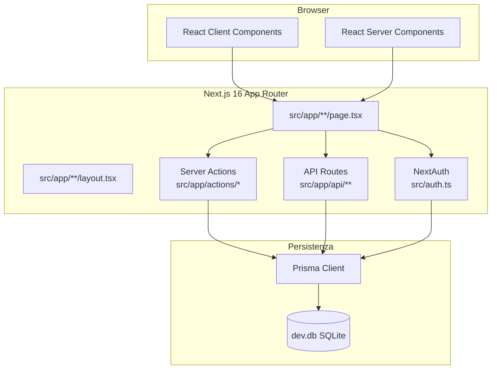
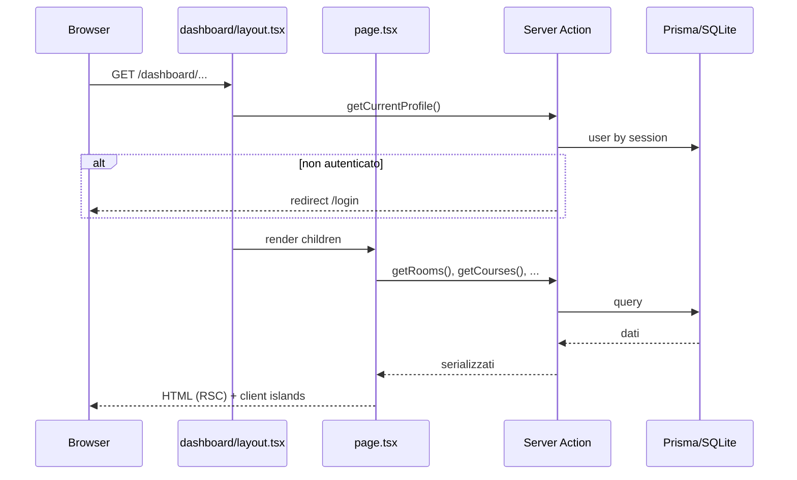
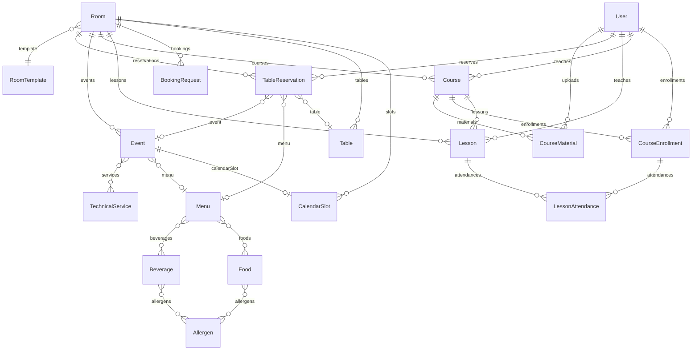
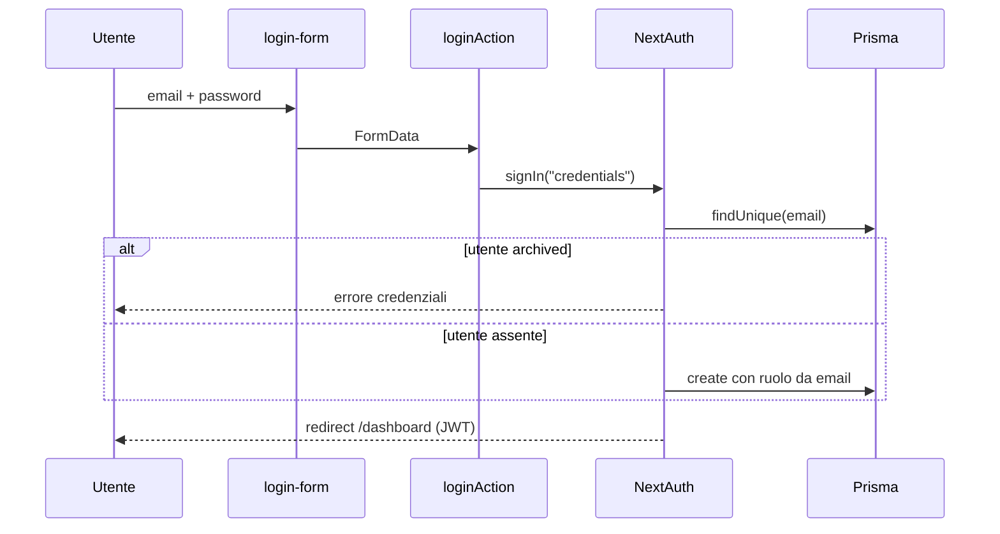
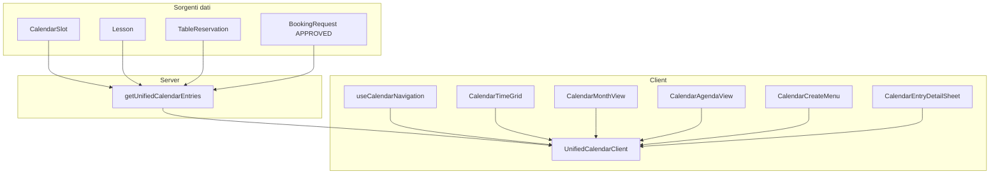

# Documentazione tecnica — Ottagora Back-Office

Documento di riferimento per **sviluppatori backend** e **agenti AI** che devono comprendere, estendere o replicare il sistema a partire da questo repository.

**Perimetro:** solo il repository corrente (back-office mock). Il progetto **non integra Odoo**. L'app utente finale sarà un prodotto separato che consumerà principalmente le **API pubbliche** e la logica di dominio documentata qui.

**Lingua:** italiano.

**Documenti correlati (funzionali, da conservare):**

| Documento | Contenuto |
|-----------|-----------|
| [`sintesi_funzionalita.md`](./sintesi_funzionalita.md) | Ruoli, matrice funzionalità, entità di dominio |
| [`flussi.md`](./flussi.md) | Flussi operativi per ruolo (diagrammi Mermaid) |
| [`user_stories.md`](./user_stories.md) | User story |
| [`giro_completo_sistema.md`](./giro_completo_sistema.md) | Setup ambiente, demo, collaudo manuale |
| [`shadcn_setup.md`](./shadcn_setup.md) | Setup componenti UI |

**Design:** i flussi di interfaccia sono definiti in **Figma** (fonte di verità UX). Questo documento descrive l'implementazione tecnica corrente.

---

## Indice

1. [Panoramica del sistema](#1-panoramica-del-sistema)
2. [Architettura](#2-architettura)
3. [Stack tecnologico](#3-stack-tecnologico)
4. [Struttura del repository](#4-struttura-del-repository)
5. [Ambiente di sviluppo](#5-ambiente-di-sviluppo)
6. [Modello dati (Prisma)](#6-modello-dati-prisma)
7. [Autenticazione e autorizzazione](#7-autenticazione-e-autorizzazione)
8. [API HTTP](#8-api-http)
9. [Server Actions](#9-server-actions)
10. [Moduli di dominio](#10-moduli-di-dominio)
11. [Calendario unificato (CAL2)](#11-calendario-unificato-cal2)
12. [Upload file](#12-upload-file)
13. [Livello UI e componenti](#13-livello-ui-e-componenti)
14. [Pattern riusabili](#14-pattern-riusabili)
15. [Regole di business critiche](#15-regole-di-business-critiche)
16. [Mappa route](#16-mappa-route)
17. [Dipendenze npm](#17-dipendenze-npm)
18. [Debito tecnico e gap verso produzione](#18-debito-tecnico-e-gap-verso-produzione)
19. [Glossario](#19-glossario)
20. [Guida estensione per sviluppatori](#20-guida-estensione-per-sviluppatori)

---

## 1. Panoramica del sistema

### 1.1 Cos'è

**Ottagora Back-Office** è una web application Next.js che gestisce l'hub multi-servizio Ottagora:

- **Sale e spazi** (formazione, riunioni, multi-spazio)
- **Eventi** e richieste di prenotazione sala
- **Ristorazione** (menu, inventario food/beverage, prenotazioni tavolo)
- **Formazione** (corsi, lezioni, docenti, iscrizioni, materiali)
- **Desk eventi** (check-in, stato sale, service tecnico)
- **Area utente simulata** nel BO (`my-training`, `my-events`) — in produzione vivrà nell'app utente

### 1.2 Fase attuale

Il sistema è un **mock funzionale** per design e validazione:

| Aspetto | Stato mock | Target produzione (indicativo) |
|---------|------------|----------------------------------|
| Database | SQLite locale (`dev.db`) | PostgreSQL o equivalente |
| Auth | NextAuth Credentials, password ignorata | Auth reale (hash, SSO, ecc.) |
| File | Data URL base64 in DB | Object storage (S3, ecc.) |
| Notifiche | Assenti / simulate in UI | Push, email |
| Delivery / take-away | Fuori scope | Da definire |
| Fatturazione | Fuori scope | Gestione interna (no Odoo) |

### 1.3 Ruoli utente

Definiti in `src/lib/user-roles.ts` e campo `User.role`:

| Ruolo | Codice | Area principale |
|-------|--------|-----------------|
| Super Admin | `SUPERADMIN` | Tutto il BO + configurazioni |
| Host Manager | `HOST_MANAGER` | Sale, eventi, richieste, tavoli |
| Restaurant Manager | `RESTAURANT_MANAGER` | Menu, inventario, prenotazioni tavolo |
| Training Manager | `TRAINING_MANAGER` | Corsi, lezioni, docenti, iscrizioni |
| Docente | `TEACHER` | Materiali, calendario lezioni |
| Event Manager | `EVENT_MANAGER` | Desk, check-in, slot |
| Amministrazione | `ADMINISTRATION` | Utenti (parziale) |
| Rider | `RIDER` | Non implementato |
| Utente | `USER` | Catalogo corsi, eventi (simulazione app) |

---

## 2. Architettura

### 2.1 Diagramma ad alto livello



### 2.2 Pattern architetturali

| Pattern | Implementazione |
|---------|-----------------|
| **App Router** | Routing file-based in `src/app/` |
| **Server Components (RSC)** | Pagine dashboard: fetch dati lato server, zero JS client dove possibile |
| **Server Actions** | Mutazioni e query da `src/app/actions/` con direttiva `"use server"` |
| **API Routes** | Endpoint REST per auth NextAuth e **contratti pubblici** verso futura app |
| **Client Components** | Form interattivi, calendario, tabelle con stato URL (`"use client"`) |
| **Nessun middleware** | Protezione auth nel layout dashboard, non in `middleware.ts` |

### 2.3 Flusso richiesta tipica (pagina dashboard)



### 2.4 Separazione BO manager vs area utente simulata

```mermaid
flowchart LR
  subgraph bo [Back-Office Manager]
    HM[Host]
    RM[Restaurant]
    TM[Training]
    EM[Events]
    SA[SuperAdmin]
  end

  subgraph sim [Simulazione app utente nel BO]
  MYT[my-training]
  MYE[my-events]
  end

  subgraph future [App utente futura]
  APP[Mobile/Web App]
  end

  API_PUB[/api/public/*]
  APP --> API_PUB
  MYT -.->|stessa logica| API_PUB
  MYE -.->|stessa logica| API_PUB
```

Le aree `my-training` e `my-events` replicano comportamenti che in produzione saranno nell'app utente, usando Server Actions interne oggi e API pubbliche come contratto verso l'esterno.

---

## 3. Stack tecnologico

### 3.1 Runtime e framework

| Tecnologia | Versione | Ruolo |
|------------|----------|-------|
| Node.js | 20+ (consigliato) | Runtime |
| Next.js | 16.x | Framework full-stack |
| React | 19.x | UI |
| TypeScript | 5.x | Tipizzazione |
| Prisma | 7.x | ORM |
| better-sqlite3 | 12.x | Driver SQLite nativo |
| @prisma/adapter-better-sqlite3 | 7.x | Adapter Prisma per SQLite |

### 3.2 Autenticazione

| Tecnologia | Versione | Ruolo |
|------------|----------|-------|
| next-auth | 5.0 beta | Sessioni JWT, provider Credentials |

### 3.3 UI e styling

| Tecnologia | Versione | Ruolo |
|------------|----------|-------|
| Tailwind CSS | 4.x | Utility CSS |
| shadcn/ui | 4.x (style `base-nova`) | Componenti copiati in `src/components/ui/` |
| @base-ui/react | 1.x | Primitivi accessibilità (base di alcuni componenti) |
| lucide-react | 1.x | Icone |
| next-themes | 0.4.x | Tema chiaro/scuro |
| sonner | 2.x | Toast notifiche |
| class-variance-authority, clsx, tailwind-merge | — | Varianti e merge classi (`cn()`) |

### 3.4 Form e validazione

| Tecnologia | Versione | Ruolo |
|------------|----------|-------|
| react-hook-form | 7.x | Gestione form client |
| @hookform/resolvers | 5.x | Integrazione resolver |
| zod | 4.x | Validazione schema (dove usata) |

### 3.5 Date e calendario

| Tecnologia | Versione | Ruolo |
|------------|----------|-------|
| date-fns | 4.x | Manipolazione date |
| react-day-picker | 9.x | Selettore date UI |

### 3.6 Tooling

| Tool | Script | Ruolo |
|------|--------|-------|
| ESLint | `npm run lint` | Linting (`eslint-config-next`) |
| Prisma CLI | `db:generate`, `db:push` | Schema e sync DB |
| Script custom | `npm run git:push` | Workflow git (`scripts/git-push-flow.sh`) |

### 3.7 Configurazione Next.js

File: `next.config.ts`

```typescript
experimental: {
  serverActions: {
    bodySizeLimit: "6mb",  // necessario per upload mock (data URL)
  },
}
```

---

## 4. Struttura del repository

```
Ottagora/
├── prisma/
│   └── schema.prisma          # Schema dati (25 modelli)
├── prisma.config.ts           # Config Prisma (DATABASE_URL)
├── dev.db                     # Database SQLite locale (gitignored in prod)
├── src/
│   ├── app/
│   │   ├── layout.tsx         # Root layout (font, theme, toaster)
│   │   ├── page.tsx           # Redirect → /login o /dashboard
│   │   ├── login/             # Pagina login
│   │   ├── actions/           # Server Actions per dominio
│   │   ├── api/               # API Routes (auth + pubbliche)
│   │   └── dashboard/         # Area autenticata BO
│   ├── auth.ts                # Config NextAuth
│   ├── components/
│   │   ├── ui/                # shadcn/ui
│   │   ├── admin/             # Componenti SuperAdmin
│   │   ├── host/              # Componenti Host Manager
│   │   ├── restaurant/        # Componenti Restaurant Manager
│   │   ├── training/          # Componenti Training Manager
│   │   ├── teacher/           # Componenti Docente
│   │   ├── events/            # Componenti Event Manager
│   │   ├── calendar/          # Calendario unificato CAL2
│   │   ├── my-events/         # Area utente eventi
│   │   └── profile/           # Anagrafica utente
│   ├── hooks/                 # Hook client riusabili
│   └── lib/                   # Logica di dominio, utility, label
├── types/
│   └── next-auth.d.ts         # Estensione tipi sessione
├── doc/                       # Documentazione
├── public/                    # Asset statici
├── components.json            # Config shadcn
├── package.json
└── tsconfig.json              # Path alias @/* → src/*
```

### 4.1 Convenzioni di naming

| Elemento | Convenzione | Esempio |
|----------|-------------|---------|
| Pagine | `page.tsx` in cartella route | `dashboard/host/rooms/page.tsx` |
| Layout | `layout.tsx` | `dashboard/layout.tsx` |
| Server Actions | `*-actions.ts` in `app/actions/` | `host-actions.ts` |
| Componenti dominio | `kebab-case.tsx` in `components/<dominio>/` | `rooms-management.tsx` |
| Librerie | `kebab-case.ts` in `lib/` | `room-availability.ts` |
| Label i18n-like | `*-labels.ts` | `training-labels.ts` |
| Hook | `use-*.ts(x)` in `hooks/` | `use-list-table.ts` |

### 4.2 Alias TypeScript

```json
"@/*": ["./src/*"]
```

---

## 5. Ambiente di sviluppo

### 5.1 Prerequisiti

- Node.js 20+
- npm
- macOS / Linux / Windows (SQLite via better-sqlite3 richiede build nativo)

### 5.2 Setup iniziale

```bash
cd Ottagora
npm install          # esegue postinstall → prisma generate
npm run db:push      # allinea schema SQLite (crea/aggiorna dev.db)
npm run dev          # http://localhost:3000
```

### 5.3 Script npm

| Script | Comando | Descrizione |
|--------|---------|-------------|
| `dev` | `next dev` | Server sviluppo con HMR |
| `build` | `prisma generate && next build` | Build produzione |
| `start` | `next start` | Avvio build produzione |
| `lint` | `eslint` | Analisi statica |
| `db:generate` | `prisma generate` | Rigenera Prisma Client |
| `db:push` | `prisma db push` | Sync schema → DB (no migration files) |
| `git:push` | `bash scripts/git-push-flow.sh` | Workflow git assistito |

### 5.4 Variabili d'ambiente

| Variabile | Obbligatoria | Uso |
|-----------|--------------|-----|
| `DATABASE_URL` | Opzionale in dev | Usata da `prisma.config.ts`; in dev il client usa path fisso `dev.db` |
| `NODE_ENV` | Automatica | Dev/prod; influisce su singleton Prisma |
| `AUTH_SECRET` | Produzione | Richiesta da NextAuth in deploy |

In sviluppo il client Prisma (`src/lib/prisma.ts`) ignora `DATABASE_URL` e punta a `path.join(process.cwd(), "dev.db")`.

### 5.5 Account mock per sviluppo

Password per tutti: `test` (non verificata dal backend).

| Ruolo | Email |
|-------|-------|
| Super Admin | `admin@ottagora.com` |
| Host Manager | `host@ottagora.com` |
| Restaurant Manager | `restaurant@ottagora.com` |
| Training Manager | `training@ottagora.com` |
| Docente | `teacher@ottagora.com` |
| Event Manager | `event@ottagora.com` |
| Utente | `user@ottagora.com` |

Al primo login con email sconosciuta, l'utente viene creato automaticamente con ruolo inferito dalla email (vedi §7).

### 5.6 Problema noto: Prisma Client stale in dev

Dopo `prisma generate` con schema modificato, il singleton in hot-reload può restare obsoleto. `src/lib/prisma.ts` implementa un **Proxy** che rileva delegate mancanti e ricrea il client. Se compaiono errori tipo `undefined is not a function` su modelli Prisma, riavviare `npm run dev`.

---

## 6. Modello dati (Prisma)

**File:** `prisma/schema.prisma`  
**Provider:** SQLite  
**ID:** `cuid()` per tutte le entità principali

### 6.1 Diagramma ER (semplificato)



### 6.2 Modelli e scopo

#### Utente e sicurezza

**User** — Anagrafica completa, ruolo, tipo (`PRIVATE`/`COMPANY`), flag `archived` per docenti disabilitati.

Campi anagrafici rilevanti: `taxCode`, indirizzo residenza, indirizzo fatturazione separato (`billingSameAsResidence`), `bio` (docente), `competencies` (docente).

#### Tassonomie (SuperAdmin)

Modelli configurazione con `name` unique, usati come stringhe libere nelle entità operative:

| Modello | Usato in |
|---------|----------|
| `TemplateType` | `RoomTemplate.type` |
| `MealTimeSlot` | `Menu.timeSlot`, `Event.timeSlot`, `Lesson.timeSlot`, `TableReservation.timeSlot` |
| `BookingType` | `BookingRequest.type` (+ flag `hasCost`) |
| `CourseType` | `Course.courseType` |
| `LessonType` | `Lesson.lessonType` |
| `Allergen` | M2M con Food/Beverage |

#### Spazi

| Modello | Note |
|---------|------|
| `Room` | `type`: `TRAINING`, `MEETING`, `MULTI_SPACE`; `availability` JSON; `hourlyCost` per sale riunioni |
| `RoomTemplate` | Layout sala con tavoli associati; può legarsi a `Event` |
| `Table` | Tavoli con capienza; relazione self M2M `associatedTables` per merge |
| `TechnicalService` | Asset tecnico; `cost` presente ma business rule: incluso nel prezzo evento/sala |
| `RoomService` | Join Room ↔ TechnicalService |
| `BookingRequest` | Richiesta prenotazione sala; stati `PENDING`/`APPROVED`/`REJECTED` |

#### Calendario

**CalendarSlot** — Slot temporale su sala. Tipi: `EVENT`, `MEETING`, `LESSON`. Stati: `DRAFT`, `PUBLISHED`, `CANCELLED`. Relazione 1:1 opzionale con `Event`.

#### Formazione

| Modello | Note |
|---------|------|
| `Course` | Ricorrenza (`weeklyDay`, `lessonsRecurring`), durata, `published`, `featured`, `teacherId`, `roomId` |
| `Lesson` | `lessonNumber`, `duration` minuti, `published` |
| `CourseEnrollment` | Candidatura/iscrizione; stati `PENDING`/`ACCEPTED`/`REJECTED`; CV in `cvUrl` |
| `LessonAttendance` | Presenza per lezione (composite PK) |
| `CourseMaterial` | `type`: `PDF`/`VIDEO`/`LINK`; su corso o lezione |

#### Ristorazione

| Modello | Note |
|---------|------|
| `Menu` | `dietType`: `VEGAN`, `VEGETARIAN`, `GLUTEN_FREE`; M2M food/beverage |
| `Food` / `Beverage` | Inventario; `unit`: `KG`, `L`, `PZ` |
| `TableReservation` | Stati `CONFIRMED`/`SEATED`/`CANCELLED`; `mergedTableIds` JSON; `checkedIn` |

#### Eventi

**Event** — Collegato a sala, menu, `CalendarSlot`, service tecnici, template sala, prenotazioni tavolo.

### 6.3 Campi JSON serializzati

| Campo | Modello | Struttura |
|-------|---------|-----------|
| `availability` | `Room` | `{ weekly: [{day, slots:[{from,to}]}], exceptions: [{date, type, slots?}] }` |
| `mergedTableIds` | `TableReservation` | Array JSON di ID tavoli uniti |

Parser: `src/lib/room-availability.ts` (`parseRoomAvailability`, `serializeRoomAvailability`).

### 6.4 Strategia migrazioni

Attualmente: **`prisma db push`** (sync diretto, senza file migration versionati).  
Per produzione: introdurre `prisma migrate` con PostgreSQL.

---

## 7. Autenticazione e autorizzazione

### 7.1 Configurazione NextAuth

**File:** `src/auth.ts`  
**Route handler:** `src/app/api/auth/[...nextauth]/route.ts`  
**Strategia sessione:** JWT

#### Flusso login



#### Inferenza ruolo da email (solo creazione utente)

| Pattern email | Ruolo assegnato |
|---------------|-----------------|
| contiene `admin` | `SUPERADMIN` |
| contiene `host` | `HOST_MANAGER` |
| contiene `restaurant` | `RESTAURANT_MANAGER` |
| contiene `training` | `TRAINING_MANAGER` |
| contiene `teacher` | `TEACHER` |
| contiene `event` | `EVENT_MANAGER` |
| contiene `amministraz` | `ADMINISTRATION` |
| altro | `USER` |

**Utente esistente:** ruolo e stato letti dal DB (modificabili dal SuperAdmin). La password **non è verificata**.

#### Estensione tipi sessione

**File:** `types/next-auth.d.ts` — aggiunge `user.id` e `user.role` a `Session`.

### 7.2 Livelli di protezione

| Livello | Meccanismo | File |
|---------|------------|------|
| Dashboard globale | `getCurrentProfile()` → redirect `/login` | `dashboard/layout.tsx` |
| Navigazione | Filtro voci per ruolo | `nav-config.ts`, `app-sidebar.tsx` |
| Pagine specifiche | `if (role !== ...) redirect(...)` | singole `page.tsx` |
| Layout modulo | Redirect docente fuori da Training | `training/layout.tsx` |
| Server Actions admin | `requireSuperAdmin()` throw | `admin-actions.ts` |
| Download CV | RBAC in `serveEnrollmentCv` | `lib/serve-enrollment-cv.ts` |
| Azioni utente finale | Check ruolo `USER` | `training-actions.ts`, `my-events-actions.ts` |

**Non esiste `middleware.ts`.**

### 7.3 Matrice accesso pagine sensibili

| Route | Ruoli ammessi |
|-------|---------------|
| `/dashboard/admin/**` | `SUPERADMIN` |
| `/dashboard/calendar` | `SUPERADMIN`, `HOST_MANAGER`, `RESTAURANT_MANAGER`, `TRAINING_MANAGER`, `EVENT_MANAGER` |
| `/dashboard/my-calendar` | `TEACHER`, `SUPERADMIN` |
| `/dashboard/my-courses` | `TEACHER`, `SUPERADMIN` |
| `/dashboard/my-training/**` | `USER`, `SUPERADMIN` |
| `/dashboard/my-events/**` | `USER`, `SUPERADMIN` |
| `/dashboard/training/**` | Tutti tranne `TEACHER` (redirect) |

### 7.4 Navigazione per ruolo

**File:** `src/lib/nav-config.ts`

- `SUPERADMIN` → menu unificato `superAdminNav` (tutte le aree + configurazioni)
- Altri ruoli → `defaultNav` filtrato per `roles` su ogni voce

La sidebar **nasconde** route non autorizzate ma non impedisce accesso diretto via URL su tutte le pagine (vedi §18).

### 7.5 Redirect post-login

| Ruolo | Comportamento su `/dashboard` |
|-------|-------------------------------|
| `USER` | Redirect → `/dashboard/my-training` |
| `TEACHER` | Overview docente inline |
| Altri | Overview specifica per ruolo |

---

## 8. API HTTP

### 8.1 Panoramica endpoint

| Route | Metodi | Auth | Scopo |
|-------|--------|------|-------|
| `/api/auth/[...nextauth]` | GET, POST | — | Sessione NextAuth |
| `/api/public/sale` | GET | No | Lista sale |
| `/api/public/corsi` | GET | No | Catalogo corsi pubblicati |
| `/api/public/menu` | GET | No | Catalogo menù |
| `/api/public/candidature` | POST | No | Candidatura corso anonima |
| `/api/public/prenotazioni` | POST | No | Richiesta prenotazione sala |
| `/api/training/enrollments/[id]/cv` | GET | Sì | Download CV candidatura |

**Route dashboard (non API):** `/dashboard/training/enrollments/[id]/cv` — stesso handler CV.

### 8.2 Formato risposta standard

**Successo:**
```json
{ "success": true, "data": { ... } }
```

**Errore:**
```json
{ "success": false, "error": "Messaggio leggibile" }
```

### 8.3 Contratti API pubbliche (per app utente)

Questi endpoint sono il **contratto backend** verso l'app utente futura.

#### `GET /api/public/sale`

Restituisce sale disponibili per prenotazione.

**Response 200:**
```json
{
  "success": true,
  "data": [
    {
      "id": "cuid",
      "name": "Sala Meeting A",
      "type": "MEETING",
      "capacity": 20,
      "status": "AVAILABLE"
    }
  ]
}
```

#### `GET /api/public/corsi`

Corsi per catalogo pubblico.

**Response 200:**
```json
{
  "success": true,
  "data": [
    {
      "id": "cuid",
      "title": "Corso Base",
      "description": "...",
      "cost": 150,
      "maxStudents": 15,
      "teacher": { "name": "Mario", "surname": "Rossi" },
      "lessons": [
        { "id": "cuid", "title": "Lezione 1", "date": "2026-06-15T09:00:00.000Z", "duration": 120 }
      ]
    }
  ]
}
```

#### `GET /api/public/menu`

Menù con composizione food/beverage.

**Response 200:**
```json
{
  "success": true,
  "data": [
    {
      "id": "cuid",
      "name": "Menu Pranzo",
      "dietType": "VEGETARIAN",
      "timeSlot": "Pranzo",
      "image": "data:image/...",
      "cost": 25,
      "foods": [{ "food": { "id": "cuid", "name": "Pasta" } }],
      "beverages": [{ "beverage": { "id": "cuid", "name": "Acqua" } }]
    }
  ]
}
```

#### `POST /api/public/candidature`

Candidatura a corso **senza autenticazione** (versione semplificata rispetto al flusso autenticato nel BO).

**Body:**
```json
{
  "studentName": "Mario Rossi",
  "studentEmail": "mario@example.com",
  "courseId": "cuid-corso"
}
```

**Response 201:** enrollment con `status: "PENDING"`  
**Response 400:** campi mancanti  
**Nota:** non accetta CV; il flusso completo con CV è in `submitMyCourseApplication` (Server Action, utente autenticato).

#### `POST /api/public/prenotazioni`

Richiesta prenotazione sala.

**Body obbligatorio:**
```json
{
  "requester": "Azienda SRL",
  "type": "Riunione",
  "date": "2026-06-20T10:00:00.000Z",
  "roomId": "cuid-sala"
}
```

**Body opzionale:**
```json
{
  "guests": 8,
  "durationMinutes": 90,
  "endTime": "2026-06-20T11:30:00.000Z",
  "cost": 0
}
```

**Validazioni:**
1. Sala esistente
2. `validateRoomBooking()` su `Room.availability`
3. `BookingType` valido (da tassonomia)
4. Calcolo costo se `BookingType.hasCost` e sala `MEETING` → `calculateMeetingCost(hourlyCost, duration)`

**Response 201:** `BookingRequest` con `status: "PENDING"`

#### `GET /api/training/enrollments/[id]/cv`

Download CV con autenticazione.

**Autorizzati:**
- `TRAINING_MANAGER`, `SUPERADMIN`
- Proprietario enrollment (`userId` o email corrispondente)

**Response:** file binario inline (data URL decodificato) o redirect a URL http(s).

---

## 9. Server Actions

Tutte in `src/app/actions/` con `"use server"`. Sono il **principale layer di business logic** del BO.

### 9.1 `auth-actions.ts`

| Funzione | Descrizione |
|----------|-------------|
| `logoutAction` | Sign out → `/login` |
| `loginAction` | Login via NextAuth |
| `getCurrentProfile` | Utente corrente o redirect login |
| `updateProfile` | Aggiorna profilo base |
| `updateUserAnagrafica` | Aggiorna anagrafica completa (validazione `user-anagrafica.ts`) |

### 9.2 `admin-actions.ts`

Tutte protette da `requireSuperAdmin()`.

| Gruppo | Funzioni CRUD |
|--------|---------------|
| Utenti | `getUsers`, `getAdminStats`, `createUser`, `updateUser`, `deleteUser` |
| TemplateType | `getTemplateTypes`, `create*`, `update*`, `delete*` |
| MealTimeSlot | idem |
| BookingType | idem + `getBookingTypeByName` |
| Allergen | idem |
| CourseType | idem |
| LessonType | idem |

### 9.3 `host-actions.ts`

| Gruppo | Funzioni |
|--------|----------|
| Rooms | `getRooms`, `createRoom`, `updateRoom`, `deleteRoom` |
| Tables | `getTables`, `createTable`, `updateTable`, `deleteTable` |
| Templates | `getTemplates`, `createTemplate`, `updateTemplate`, `deleteTemplate` |
| Services | `getServices`, `createService`, `updateService`, `deleteService` |
| BookingRequests | `getBookingRequests`, `getBookingRequest`, `create*`, `update*`, `delete*`, `updateBookingRequestStatus` |
| Calendar/Events | `getCalendarSlots`, `getEvents`, `getEvent`, `createEvent`, `updateEvent`, `deleteEvent` |

**Side effect:** su approvazione richiesta e creazione evento, genera/aggiorna `CalendarSlot` e chiama `revalidateCalendarPaths()`.

### 9.4 `restaurant-actions.ts`

| Gruppo | Funzioni |
|--------|----------|
| Menu | CRUD completo |
| Inventory | Food, Beverage, item generico |
| Reservations | CRUD prenotazioni tavolo + `getUsersForTableReservation` |

### 9.5 `training-actions.ts`

| Gruppo | Funzioni principali |
|--------|---------------------|
| Courses | CRUD + `generateCourseLessons`, `getSuggestedLessonNumber` |
| Lessons | CRUD |
| Teachers | CRUD + `archiveTeacher`, `unarchiveTeacher`, `getActiveTeachers` |
| Materials | `getMaterialsForCourse/Lesson`, `addMaterial`, `deleteMaterial` |
| Enrollments | CRUD stato + `acceptEnrollmentWithRequirements`, `setLessonAttendance` |
| Room conflicts | `releaseTrainingRoomConflicts`, `checkTrainingRoomConflict` (via lib) |
| Area utente | `getMyTrainingCatalog`, `getMyTrainingCourseDetail`, `submitMyCourseApplication` |

### 9.6 `teacher-actions.ts`

| Funzione | Descrizione |
|----------|-------------|
| `getTeacherDashboardData` | KPI e corsi docente |
| `getTeacherCourseForMaterials` | Corso con materiali (ownership) |
| `getTeacherLessonForMaterials` | Lezione con materiali (ownership) |
| `teacherAddMaterial` | Upload materiale (solo propri corsi/lezioni) |

### 9.7 `event-actions.ts`

| Funzione | Descrizione |
|----------|-------------|
| `getTodayArrivals` | Arrivi odierni (booking + prenotazioni tavolo) |
| `searchTodayArrivals` | Ricerca desk |
| `getTodayCalendarSlots` | Slot calendario oggi |
| `checkInBooking` / `checkInReservation` | Check-in desk |
| `getRoomStatuses` | Stato sale live |
| `updateRoomStatus` / `updateRoomNotes` | Gestione sala |
| `replaceTodayEventServices` | Service tecnico evento del giorno |

### 9.8 `my-events-actions.ts`

| Funzione | Descrizione |
|----------|-------------|
| `getMyEventsCatalog` | Eventi disponibili per utente |
| `getMyEventDetail` | Dettaglio evento + menu |
| `submitMyEventTableReservation` | Prenotazione tavolo su evento (solo `USER`) |

### 9.9 `calendar-actions.ts`

| Funzione | Descrizione |
|----------|-------------|
| `getUnifiedCalendarEntries` | Aggregazione 4 sorgenti → `UnifiedCalendarEntry[]` |

---

## 10. Moduli di dominio

### 10.1 Super Admin

**Route:** `/dashboard/admin/**`  
**Componenti:** `src/components/admin/`  
**Actions:** `admin-actions.ts`

Gestisce:
- Utenti e ruoli
- Tassonomie (tipologie template, corso, lezione, prenotazione, fasce orarie, allergeni)

La dashboard home (`/dashboard`) per SUPERADMIN mostra `SuperAdminOverview` con statistiche da `getAdminStats()`.

### 10.2 Host Manager

**Route:** `/dashboard/host/**`  
**Componenti:** `src/components/host/`  
**Actions:** `host-actions.ts`

| Funzionalità | Entità | Note tecniche |
|--------------|--------|---------------|
| Sale | `Room` | Editor disponibilità JSON su `/rooms/[id]/calendar` |
| Tavoli | `Table` | Merge tavoli via self-relation |
| Template sala | `RoomTemplate` | Associazione tavoli |
| Service tecnico | `TechnicalService`, `RoomService` | Stato AVAILABLE/MAINTENANCE |
| Eventi | `Event`, `CalendarSlot` | Creazione genera slot calendario |
| Richieste sala | `BookingRequest` | Workflow PENDING → APPROVED/REJECTED |
| Prenotazioni tavolo (host) | `TableReservation` | Route `/host/table-reservations` |

### 10.3 Restaurant Manager

**Route:** `/dashboard/restaurant/**`  
**Componenti:** `src/components/restaurant/`  
**Actions:** `restaurant-actions.ts`

| Funzionalità | Entità |
|--------------|--------|
| Menù | `Menu` + join Food/Beverage |
| Inventario | `Food`, `Beverage`, `Allergen` |
| Prenotazioni tavolo | `TableReservation` |

### 10.4 Training Manager

**Route:** `/dashboard/training/**`  
**Componenti:** `src/components/training/`  
**Actions:** `training-actions.ts`  
**Layout guard:** docenti esclusi

| Funzionalità | Entità | Note |
|--------------|--------|------|
| Corsi | `Course` | Piano lezioni, publish gate (`course-lesson-plan.ts`) |
| Lezioni | `Lesson` | Setup batch da corso |
| Docenti | `User` (role TEACHER) | Archiviazione senza cancellazione |
| Iscrizioni | `CourseEnrollment` | Workflow accettazione, CV, presenze |
| Materiali | `CourseMaterial` | PDF/VIDEO/LINK |
| Conflitti sala | — | Override su sale TRAINING (§15) |

### 10.5 Docente (Teacher)

**Route:** `/dashboard/my-courses`, `/dashboard/my-calendar`  
**Componenti:** `src/components/teacher/`  
**Actions:** `teacher-actions.ts`, dati da `teacher-page-data.ts`

- Visualizza solo corsi/lezioni assegnati
- Carica materiali didattici
- Calendario personale lezioni (`teacher-calendar-entries.ts`)

### 10.6 Event Manager

**Route:** `/dashboard/events/**`  
**Componenti:** `src/components/events/`  
**Actions:** `event-actions.ts`, `event-page-data.ts`

| Funzionalità | Descrizione |
|--------------|-------------|
| Desk eventi | Check-in arrivi, ricerca |
| Vista slot | Slot calendario giornata |
| Service tecnico | Stato asset per eventi oggi |
| Gestione eventi | Redirect a `/dashboard/host/events` |

### 10.7 Area utente simulata

**Route:** `/dashboard/my-training/**`, `/dashboard/my-events/**`  
**Ruolo:** `USER` (SUPERADMIN per debug)

Replica funzionalità app utente:
- Catalogo corsi e candidatura con CV
- Catalogo eventi e prenotazione tavolo

**Server Actions:** `training-actions.ts` (`submitMyCourseApplication`), `my-events-actions.ts`

### 10.8 Profilo utente

**Route:** `/dashboard/profile`  
**Componenti:** `profile-client.tsx`, `user-anagrafica-fields.tsx`  
**Validazione:** `src/lib/user-anagrafica.ts` (codice fiscale, CAP, province, ecc.)

---

## 11. Calendario unificato (CAL2)

Sottosistema trasversale che aggrega tutte le occupazioni temporali.

### 11.1 Architettura



### 11.2 Tipi calendario

**File:** `src/lib/unified-calendar.ts`

| `CalendarKind` | Colore | Sorgente |
|----------------|--------|----------|
| `event` | Blu | `CalendarSlot` type EVENT |
| `meeting` | Ambra | `CalendarSlot` type MEETING / Booking |
| `lesson` | Viola | `Lesson` |
| `table` | Rosa | `TableReservation` CONFIRMED/SEATED |

### 11.3 Aggregazione (`getUnifiedCalendarEntries`)

1. **CalendarSlot** — esclude slot type LESSON (le lezioni arrivano da `Lesson`)
2. **Lesson** — durata da `lesson.duration` minuti
3. **TableReservation** — range orario da `MealTimeSlot` via `getReservationCalendarRange()`
4. **BookingRequest** — solo APPROVED, usati per link modifica su slot "Prenotazione:"

Ogni entry espone:
- `editHref` — link modifica entità
- `referenceHref` — link entità collegata (es. corso da lezione)

### 11.4 Viste e navigazione

**Hook:** `use-calendar-navigation.ts`  
**Viste:** day, week, month, agenda

**Prefill creazione:** click su slot vuoto → URL con `?date=yyyy-MM-dd&time=HH:mm` (`calendar-prefill.ts`, `buildCalendarCreateHref`)

### 11.5 Azioni "Crea" per ruolo

**File:** `calendar-create-actions.ts`

| Ruolo | Azioni disponibili |
|-------|-------------------|
| HOST_MANAGER | Evento, Richiesta sala, Prenotazione tavolo |
| RESTAURANT_MANAGER | Prenotazione tavolo |
| TRAINING_MANAGER | Corso, Lezione |
| EVENT_MANAGER | Evento, Richiesta sala, Prenotazione tavolo |
| SUPERADMIN | Tutte |

### 11.6 Calendario per sala (separato)

**Route:** `/dashboard/host/rooms/[id]/calendar`  
**Componente:** `room-calendar-config.tsx` / `RoomCalendarEditor`  
**Scopo:** editing `Room.availability` (giorni, fasce, eccezioni) — **non** è il calendario unificato.

### 11.7 Invalidazione cache

**File:** `calendar-revalidate.ts`  
Chiamato dopo mutazioni che impattano il calendario (eventi, lezioni, prenotazioni, richieste).

### 11.8 Limitazioni note

- Nessun drag & drop
- Nessuna modifica inline degli slot
- Lezioni e slot LESSON su CalendarSlot sono deduplicati (priorità a `Lesson`)

---

## 12. Upload file

### 12.1 Architettura mock

Nessun object storage. I file vengono letti nel browser, convertiti in **data URL base64** e salvati come stringa nel DB.

**File:** `src/lib/file-upload.ts`

| Costante | Valore |
|----------|--------|
| `MAX_UPLOAD_FILE_BYTES` | 4 MB |
| `MAX_DATA_URL_LENGTH` | ~5.5 MB (stima base64) |

**Next.js server action limit:** 6 MB (`next.config.ts`)

### 12.2 Tipi di upload

| Tipo | Campo DB | Componente UI | Note |
|------|----------|---------------|------|
| Immagini | `image` su Course, Menu, Food, Beverage, Event | `image-field.tsx` | URL esterno o data URL |
| CV PDF | `CourseEnrollment.cvUrl`, `cvFileName` | `document-field.tsx` | Mai esposto al client |
| Materiali | `CourseMaterial.url` | form materiali | PDF/VIDEO/LINK |

### 12.3 Sicurezza CV

1. `stripEnrollmentCv()` rimuove `cvUrl` dalle risposte al client
2. Download solo via route autenticata
3. `serveEnrollmentCv()` decodifica data URL o redirect a URL esterno

**Path API CV:**
- `/api/training/enrollments/[id]/cv`
- `/dashboard/training/enrollments/[id]/cv`

---

## 13. Livello UI e componenti

### 13.1 shadcn/ui

Componenti in `src/components/ui/` — **codice sorgente nel repo**, non pacchetto npm.

Config: `components.json` (style `base-nova`, base color `neutral`, CSS variables, icon library `lucide`).

Per aggiungere componenti: `npx shadcn@latest add <component>` (vedi `doc/shadcn_setup.md`).

### 13.2 Layout applicazione

| File | Ruolo |
|------|-------|
| `app/layout.tsx` | Font Montserrat, ThemeProvider, Toaster |
| `dashboard/layout.tsx` | Sidebar + auth gate |
| `app-sidebar.tsx` | Navigazione ruolo-aware |
| `theme-provider.tsx` | Dark/light mode (localStorage) |

### 13.3 Componenti per dominio

| Cartella | Modulo |
|----------|--------|
| `components/admin/` | SuperAdmin |
| `components/host/` | Host Manager |
| `components/restaurant/` | Restaurant Manager |
| `components/training/` | Training Manager |
| `components/teacher/` | Docente |
| `components/events/` | Event Manager |
| `components/calendar/` | Calendario CAL2 |
| `components/my-events/` | Area utente eventi |
| `components/profile/` | Profilo/anagrafica |

### 13.4 Form

Pattern tipico:
1. Server Component carica dati
2. Client Component con `react-hook-form`
3. Submit → Server Action
4. Feedback → `sonner` toast
5. `revalidatePath()` lato server

---

## 14. Pattern riusabili

### 14.1 List Table (filtri, sort, paginazione via URL)

**File chiave:**
- `hooks/use-list-table.ts`
- `lib/list-table/types.ts`
- `lib/list-table/url-keys.ts`
- `lib/list-table/helpers.ts`
- `components/ui/list-table-toolbar.tsx`
- `components/ui/list-table-pagination.tsx`
- `components/ui/sortable-table-head.tsx`

**Comportamento:**
- Stato tabella serializzato in query string (`?status=active&sort=name&order=asc&page=2`)
- Supporto prefisso per più tabelle nella stessa pagina
- Filtri definiti con `ListFilterDef[]`
- Sort su colonne configurabili

**Uso:** tutte le pagine lista (sale, corsi, iscrizioni, inventario, ecc.)

### 14.2 Label e tassonomie

I valori di dominio (tipologie, stati, giorni) hanno file label dedicati:

| File | Contenuto |
|------|-----------|
| `training-labels.ts` | Stati enrollment, materiali |
| `restaurant-labels.ts` | Dieta, inventario, prenotazioni |
| `host-labels.ts` | Stati sala, tavolo |
| `meal-time-slot-labels.ts` | Fasce orarie |
| `course-type-labels.ts` | Tipologie corso |
| `lesson-type-labels.ts` | Tipologie lezione |
| `template-type-labels.ts` | Tipologie template |
| `booking-type-labels.ts` | Tipologie prenotazione |

### 14.3 Conferma eliminazione

**Hook:** `use-confirm-delete.tsx` — dialog conferma prima di delete Server Action.

### 14.4 Validazione temporale

| File | Scopo |
|------|-------|
| `time-range.ts` | `buildDateTime`, validazione range |
| `duration-minutes.ts` | Conversione ore ↔ minuti |
| `course-date-validation.ts` | Date corso/lezione coerenti |
| `course-duration-validation.ts` | Budget durata lezioni |
| `course-schedule-dates.ts` | Date ricorrenti corso |
| `meal-slot-range.ts` | Range prenotazione da fascia oraria |

### 14.5 Revalidation

Dopo mutazioni, le Server Actions chiamano `revalidatePath()` sui path interessati. Per il calendario: `revalidateCalendarPaths()`.

---

## 15. Regole di business critiche

### 15.1 Priorità Training Manager sulle sale formazione

Il Training Manager ha **priorità assoluta** sulle sale `type = TRAINING`.

**Implementazione:** `src/lib/training-room-conflict.ts`, `src/lib/room-conflict.ts`

Quando TM assegna una sala formazione a corso/lezione:
1. `checkTrainingRoomConflict()` rileva sovrapposizioni con:
   - Altre `Lesson`
   - `BookingRequest` non REJECTED
   - `TableReservation` attive
2. UI mostra dialog conflitti (`training-room-override-dialog.tsx`)
3. `releaseTrainingRoomConflicts()` può cancellare/respingere prenotazioni in conflitto
4. Notifica HM/RM è mock (nessun sistema notifiche reale)

### 15.2 Service tecnico senza costo proprio

`TechnicalService.cost` esiste nello schema ma la regola di dominio (da `sintesi_funzionalita.md`) è che il service è **incluso nel prezzo** evento/sala riunione.

### 15.3 Costo sale riunioni

Per `BookingType.hasCost = true` e sala `MEETING`:
```
costo = hourlyCost × (durationMinutes / 60)
```
Funzione: `calculateMeetingCost()` in `room-availability.ts`

### 15.4 Disponibilità sala

`validateRoomBooking()` verifica:
- Giorno nella schedule settimanale
- Fascia oraria compatibile
- Eccezioni calendario (chiusure, orari custom)

### 15.5 Piano lezioni corso

`course-lesson-plan.ts` gestisce:
- Generazione lezioni da parametri corso
- Gate di pubblicazione (corso non pubblicabile senza piano lezioni completo)
- Banner setup lezioni (`course-lesson-plan-banner.tsx`)

### 15.6 Docente archiviato

`User.archived = true`:
- Login negato
- Dati conservati
- Riattivazione con `unarchiveTeacher()`

### 15.7 Merge tavoli

`TableReservation.mergedTableIds` (JSON) + `table-reservation-utils.ts` calcolano capienza totale tavoli uniti.

### 15.8 Check-in desk

`BookingRequest.checkedIn` e `TableReservation.checkedIn` gestiti da Event Manager via `event-actions.ts`.

---

## 16. Mappa route

### 16.1 Route pubbliche

| Path | Tipo |
|------|------|
| `/` | Redirect |
| `/login` | Login |

### 16.2 Dashboard — comuni

| Path | Ruoli |
|------|-------|
| `/dashboard` | Tutti (overview per ruolo) |
| `/dashboard/profile` | Tutti autenticati |
| `/dashboard/calendar` | Manager (vedi §7.3) |

### 16.3 Dashboard — Admin

| Path |
|------|
| `/dashboard/admin` |
| `/dashboard/admin/users/new` |
| `/dashboard/admin/template-types` |
| `/dashboard/admin/course-types` |
| `/dashboard/admin/lesson-types` |
| `/dashboard/admin/booking-types` |
| `/dashboard/admin/meal-time-slots` |
| `/dashboard/admin/allergens` |

### 16.4 Dashboard — Host

| Path |
|------|
| `/dashboard/host` |
| `/dashboard/host/rooms`, `/rooms/[id]`, `/rooms/[id]/calendar` |
| `/dashboard/host/tables`, `/tables/[id]`, `/tables/new` |
| `/dashboard/host/templates`, `/templates/[id]`, `/templates/new` |
| `/dashboard/host/services`, `/services/[id]`, `/services/new` |
| `/dashboard/host/events`, `/events/[id]`, `/events/new` |
| `/dashboard/host/requests`, `/requests/[id]`, `/requests/new` |
| `/dashboard/host/table-reservations`, `/[id]`, `/new` |
| `/dashboard/host/calendar` → redirect `/dashboard/calendar` |

### 16.5 Dashboard — Restaurant

| Path |
|------|
| `/dashboard/restaurant` |
| `/dashboard/restaurant/menu`, `/menu/[id]`, `/menu/new` |
| `/dashboard/restaurant/inventory`, `/inventory/[id]`, `/inventory/new` |
| `/dashboard/restaurant/reservations`, `/reservations/[id]`, `/reservations/new` |

### 16.6 Dashboard — Training

| Path |
|------|
| `/dashboard/training/courses`, `/courses/[id]`, `/courses/new`, `/courses/[id]/lessons/setup` |
| `/dashboard/training/lessons`, `/lessons/[id]`, `/lessons/new` |
| `/dashboard/training/teachers`, `/teachers/[id]`, `/teachers/new` |
| `/dashboard/training/enrollments`, `/enrollments/[id]/cv` |

### 16.7 Dashboard — Events

| Path |
|------|
| `/dashboard/events` |
| `/dashboard/events/slots` |
| `/dashboard/events/services` |
| `/dashboard/events/list` → redirect `/dashboard/host/events` |

### 16.8 Dashboard — Teacher / User

| Path | Ruoli |
|------|-------|
| `/dashboard/my-courses` | TEACHER |
| `/dashboard/my-calendar` | TEACHER |
| `/dashboard/my-training`, `/my-training/courses/[id]` | USER |
| `/dashboard/my-events`, `/my-events/[id]` | USER |
| `/dashboard/teacher` | Legacy redirect |

---

## 17. Dipendenze npm

### 17.1 Produzione

| Pacchetto | Scopo |
|-----------|-------|
| `next` | Framework |
| `react`, `react-dom` | UI runtime |
| `@prisma/client` | ORM client |
| `@prisma/adapter-better-sqlite3` | Adapter SQLite |
| `better-sqlite3` | Driver DB nativo |
| `next-auth` | Autenticazione |
| `zod` | Validazione |
| `react-hook-form`, `@hookform/resolvers` | Form |
| `date-fns` | Date |
| `react-day-picker` | Date picker |
| `lucide-react` | Icone |
| `next-themes` | Tema |
| `sonner` | Toast |
| `class-variance-authority`, `clsx`, `tailwind-merge` | Styling utility |
| `@base-ui/react` | Primitivi UI |
| `shadcn` | CLI componenti |
| `tw-animate-css` | Animazioni CSS |

### 17.2 Sviluppo

| Pacchetto | Scopo |
|-----------|-------|
| `typescript` | Tipizzazione |
| `prisma` | CLI ORM |
| `eslint`, `eslint-config-next` | Linting |
| `tailwindcss`, `@tailwindcss/postcss` | CSS |
| `@types/*` | Tipi TypeScript |

---

## 18. Debito tecnico e gap verso produzione

### 18.1 Stato mock esplicito

| Area | Gap | Azione produzione |
|------|-----|-------------------|
| Auth | Password non verificata, ruolo da email al signup | Hash bcrypt/argon2, inviti, SSO |
| DB | SQLite file locale | PostgreSQL + migrate |
| File | Data URL in DB | S3/Cloudinary + signed URL |
| RBAC server | Molte actions non verificano ruolo | Middleware o guard centralizzato per action |
| RBAC client | Solo sidebar + redirect pagina | Controllo uniforme su ogni mutazione |
| API pubbliche | Nessun rate limit, nessuna API key | Autenticazione app, throttling |
| Notifiche | Assenti | Firebase/APNs, email transazionali |
| ADMINISTRATION | Solo voce menu utenti | Implementare modulo completo |
| RIDER | Ruolo definito, non implementato | Modulo delivery futuro |
| Seed | Nessun seed automatico | Script seed per staging |
| CI/CD | Assente | Pipeline build, lint, deploy |
| i18n | Solo italiano hardcoded | Sistema traduzioni |
| OpenAPI | Contratti inline | Spec OpenAPI generata |

### 18.2 Gap sicurezza noti

1. Utente autenticato con qualsiasi ruolo può tecnicamente chiamare Server Actions di altri moduli (sessione valida basta)
2. API pubbliche senza autenticazione né CORS documentato
3. CV e immagini in DB come blob testuale — non scalabile
4. Nessun audit log delle operazioni

### 18.3 Funzionalità fuori scope (confermato)

- Odoo / ERP esterno
- Delivery e take-away
- Drag & drop calendario
- Fatturazione
- App utente finale (progetto separato, consumerà API pubbliche)

---

## 19. Glossario

| Termine | Significato tecnico |
|---------|---------------------|
| **CAL2** | Calendario unificato v2 — aggregazione multi-sorgente |
| **Slot** | `CalendarSlot` — occupazione temporale su sala |
| **Kind** | Tipologia visuale calendario: event, meeting, lesson, table |
| **BookingRequest** | Richiesta prenotazione sala (workflow approvazione) |
| **TableReservation** | Prenotazione tavolo ristorante/evento |
| **Enrollment** | `CourseEnrollment` — candidatura/iscrizione corso |
| **Template sala** | `RoomTemplate` — configurazione layout tavoli |
| **Tassonomia** | Modelli TemplateType, MealTimeSlot, ecc. — configurazione SuperAdmin |
| **Data URL** | Stringa `data:mime;base64,...` usata come storage mock file |
| **Server Action** | Funzione async `"use server"` invocabile dal client React |
| **RSC** | React Server Component — renderizzato lato server |
| **Override sala** | Cancellazione forzata prenotazioni in conflitto da Training Manager |
| **Desk** | Interfaccia Event Manager per check-in giornata |
| **Publish gate** | Vincolo pubblicazione corso legato a piano lezioni |

---

## 20. Guida estensione per sviluppatori

### 20.1 Aggiungere un'entità al database

1. Modificare `prisma/schema.prisma`
2. `npm run db:push`
3. Riavviare dev server (per Prisma Client)
4. Creare Server Actions in `app/actions/`
5. Creare pagine in `app/dashboard/<modulo>/`
6. Creare componenti in `components/<modulo>/`
7. Aggiungere voce menu in `nav-config.ts` con `roles`
8. Se impatta calendario: aggiornare `getUnifiedCalendarEntries()` e `revalidateCalendarPaths()`

### 20.2 Aggiungere un endpoint API pubblico

1. Creare `src/app/api/public/<nome>/route.ts`
2. Esportare `GET`/`POST` con validazione input
3. Usare formato `{ success, data?, error? }`
4. Documentare contratto in questo file
5. Per logica condivisa: estrarre in `src/lib/` e riusare da Server Actions

### 20.3 Aggiungere una pagina dashboard per ruolo

1. Creare `src/app/dashboard/<area>/<nome>/page.tsx`
2. Aggiungere guard ruolo in cima alla page:
   ```typescript
   const user = await getCurrentProfile()
   if (user.role !== "EXPECTED_ROLE" && user.role !== "SUPERADMIN") {
     redirect("/dashboard")
   }
   ```
3. Aggiungere voce in `nav-config.ts`
4. Implementare Server Actions dedicate

### 20.4 Estendere il calendario unificato

1. Aggiungere sorgente in `getUnifiedCalendarEntries()`
2. Mappare a `CalendarKind` in `unified-calendar.ts`
3. Aggiungere stile in `calendarKindStyle`
4. Configurare `editHref` per navigazione al form
5. Chiamare `revalidateCalendarPaths()` dalle mutazioni

### 20.5 Creare l'app utente da questa base

**Backend da riusare:**
- Schema Prisma (adattato a PostgreSQL)
- Logica in `src/lib/` (disponibilità sale, conflitti, validazioni)
- Contratti `/api/public/*`
- Flussi autenticati: replicare `submitMyCourseApplication`, `submitMyEventTableReservation`

**Da sostituire:**
- Server Actions → API REST autenticate
- Data URL upload → object storage
- NextAuth mock → auth produzione
- Pagine `my-*` nel BO → schermate app nativa/web

**Riferimenti UX:** flussi Figma (fonte di verità interazione utente finale).

### 20.6 Checklist pre-modifica per agenti AI

1. Leggere `prisma/schema.prisma` per entità coinvolte
2. Verificare Server Actions esistenti prima di crearne di nuove
3. Rispettare pattern list-table per pagine lista
4. Usare file `*-labels.ts` per testi di dominio
5. Chiamare `revalidatePath` / `revalidateCalendarPaths` dopo mutazioni
6. Non esporre `cvUrl` al client — usare `stripEnrollmentCv()`
7. Per sale TRAINING: sempre verificare conflitti
8. Consultare `doc/flussi.md` per flusso operativo e Figma per UX

---

## Riferimenti incrociati

| Bisogno | Documento |
|---------|-----------|
| Matrice ruoli × funzionalità | [`sintesi_funzionalita.md`](./sintesi_funzionalita.md) |
| Flussi operativi con diagrammi | [`flussi.md`](./flussi.md) |
| User story | [`user_stories.md`](./user_stories.md) |
| Setup demo e collaudo manuale | [`giro_completo_sistema.md`](./giro_completo_sistema.md) |
| Aggiunta componenti UI | [`shadcn_setup.md`](./shadcn_setup.md) |
| UX e wireflow | Figma (esterno al repo) |

---

*Ultimo aggiornamento: giugno 2026 — allineato al codebase back-office mock v0.1.0.*
