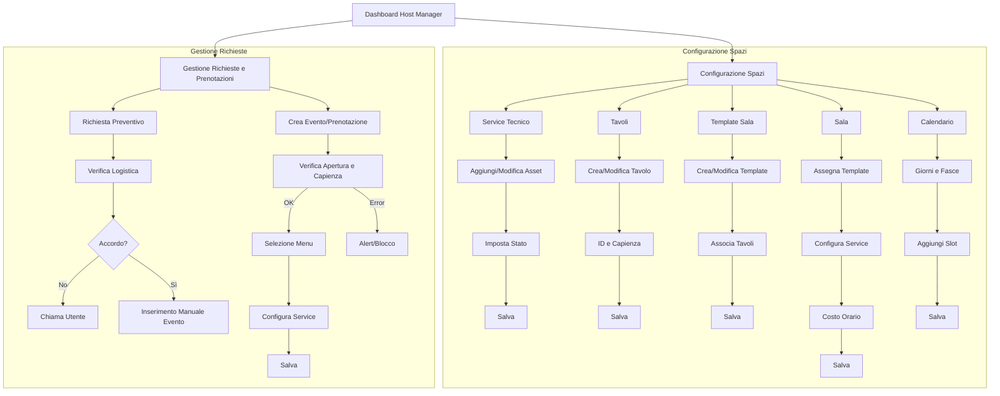
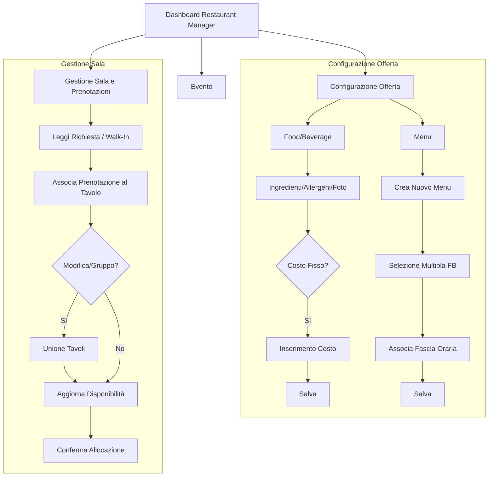

# Flussi di Piattaforma - Progetto Ottagora

Questo documento descrive i flussi operativi per i vari ruoli della piattaforma Ottagora, estrapolati dai diagrammi di flusso forniti.

## 1. Host Manager
La dashboard dell'Host Manager consente la gestione degli spazi, delle richieste e delle prenotazioni.

### Diagramma di Flusso: Host Manager

### Dettagli Operativi
- **Seleziona Service tecnico:** Permette di aggiungere un nuovo asset (es. Proiettore) o modificarne uno esistente, impostandone lo stato (Disponibile/Manutenzione). *Il service tecnico non ha un costo proprio: è incluso nel prezzo dell'evento o della sala riunioni.*
- **Seleziona Tavoli:** Creazione o modifica di un tavolo inserendo l'identificativo (es. T1) e la capienza (posti).
- **Seleziona Template Sala:** Creazione o modifica di un template inserendo un nome (es. Platea/Meeting) e associando i tavoli al template.
- **Seleziona Sala:** Assegnazione di un template alla sala, configurazione del service tecnico associato, impostazione del costo orario.
- **Seleziona Calendario:** Impostazione dei giorni di apertura e delle fasce orarie.

---

## 2. Restaurant Manager
Gestisce l'offerta food, le prenotazioni dei tavoli e gli eventi in area ristorazione.

### Diagramma di Flusso: Restaurant Manager

### Dettagli Operativi
- **Food/Beverage:** Creazione di elementi tramite l'inserimento di ingredienti, allergeni, foto, e quantità.
- **Sezione Menu:** Creazione di un "Nuovo menu" con selezione multipla degli elementi Food/Beverage e associazione a una fascia oraria.
- **Sezione Prenotazione:** Gestione delle richieste (incluse Walk-In), associazione al tavolo, gestione unioni tavoli per gruppi e aggiornamento disponibilità.

---

## 3. Training Manager
Gestione dei corsi, dei docenti, delle aule e dei candidati.

### Diagramma di Flusso: Training Manager

```mermaid
graph TD
    TM[Dashboard Training Manager] --> TC[Corsi e Docenti]
    TM --> SO[Spazi e Override]
    TM --> GC[Gestione Candidati]

    subgraph "Corsi e Docenti"
        TC --> Teacher[Aggiungi Teacher] --> T_Bio[Info e Bio] --> T_Save[Salva]
        TC --> Course[Crea Corso] --> C_Data[Nome/Tipo/Durata] --> C_File[Upload Materiali]
        C_File --> C_Plan[Pianifica Lezioni] --> C_Rec{Ricorrenza?}
        C_Rec -- Sì --> C_Cal[Genera Slot Calendario]
        C_Rec -- No --> C_Cal
    end

    subgraph "Override Spazi"
        SO --> Room[Selezione Sala]
        Room --> Free{Libera?}
        Free -- No --> Libera[Libera Spazio] --> Notif[Notifica HM/RM]
        Free -- Sì --> Val[Validazione Capienza] --> S_Save[Salva]
    end

    subgraph "Candidati"
        GC --> List[Elenco Iscritti]
        List --> Req{Requisiti?}
        Req -- Sì --> Acc[Accettato] --> Area[Sblocca Area Personale]
        Req -- No --> Rej[Escluso]
    end
```

---

## 4. Altri Ruoli

### Event Manager
- **Check-in:** Ricerca anagrafica e check-in manuale all'arrivo dell'utente.
- **Service Tecnico:** Monitoraggio stato asset. Se un dispositivo è in manutenzione, permette la sostituzione con un altro asset disponibile.

### Teacher
- **Didattica:** Visualizzazione calendario, dettagli corsi e upload autonomo dei materiali (PDF/Video/Link).
- **Profilo:** Gestione delle proprie informazioni anagrafiche e bio.

### User (Utente Finale)
- **Profilazione:** Registrazione come Azienda o Privato, gestione diete e buoni pasto.
- **Prenotazioni:** Prenotazione tavoli (Food & Beverage) o sale riunioni (Workspace), con visualizzazione costi e storico.
- **Formazione:** Consultazione catalogo corsi e invio candidature. Se accettato, accesso ai materiali didattici.
